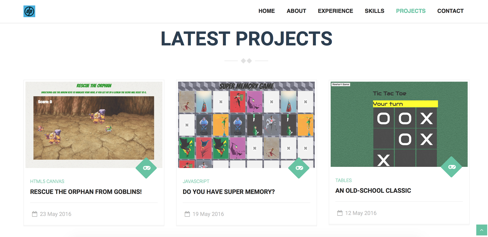

# My Developer Portfolio

A showcase of sample projects/assignments I've done while attending code-school, DigitalCrafts. Components leveraged to create the portfolio include: HTML5, CSS3, Bootstrap, JavaScript, modals, font-awesome icons, etc.


### Content

You can expect to see:

```
* Summary
* Timeline of my work experience
* Samples of my work
* Downloadable Resume
```

### Screenshot


##### URL to live portoflio

# http://phamous2day.github.io/


